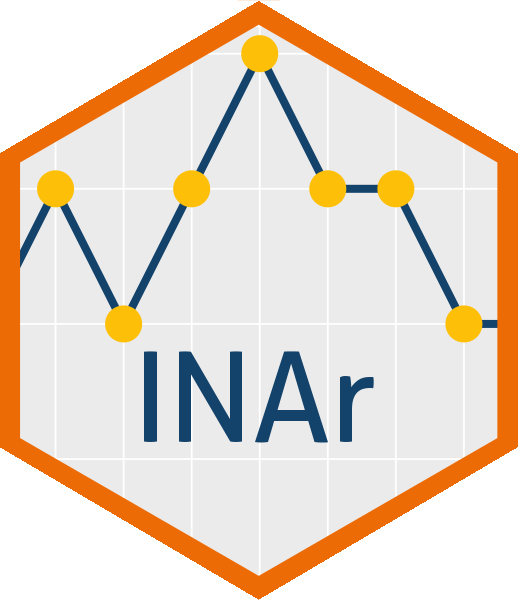

# INAr R Project 
Generation, estimation and testing of Integer Autoregressive models

<!-- badger source: https://github.com/GuangchuangYu/badger -->
<!-- badges: start -->
[](https://cran.r-project.org/package=INAr)
[](https://github.com/blog-neas/INAr/actions/workflows/check-standard.yaml)
[](https://lifecycle.r-lib.org/articles/stages.html#experimental)
[](https://www.repostatus.org/#active)
[](https://codecov.io/gh/blog-neas/INAr)
[](https://cran.r-project.org/web/licenses/GPL-3)
<!-- badges: end -->


## Overview

The INAr is a package for the study of integer-valued autoregressive models, namely INAR(p), considered the counterpart to the conventional autoregressive models AR(p).
INAR(p) models are proved to useful for the study of realizations of random variables arising from counting, with range contained in the discrete set of non-negative integers.
The package aims to provide tools for the generation, estimation and testing of these models.
For a detailed description of the package functionalities, please refer to the [vignettes]().

INAr is not the only R package for the analysis of integer-valued time series, but it is among the few ones specifically focused on INAR(p) processes. Here are some others:

- [tsinteger](https://github.com/RLesur/crrri) by Manoel Santos

- [spINAR](https://github.com/MFaymon/spINAR) by Maxime Faymonville

- [tscount](https://r-packages.io/packages/tscount) by Tobias Liboschik

## Installation

``` r
# Install from CRAN 
# !!!---not available at the moment---!!!
# install.packages("INAr")

# Or the latest stable GitHub version
# install.packages("devtools")
devtools::install_github("blog-neas/INAr")

# Or the development version from GitHub
# install.packages("devtools")
devtools::install_github("blog-neas/INAr", ref = "devel")
```


## Roadmap

#### Main Steps

The INAr package will provide functions for the generation, estimation and test INAR(p) processes with different types of innovations. 
Some functionalities are already available, while others are planned for the future develpoments. In particular, the main steps are listed below:

1. **Generation of INAR(p) processes** 

- [x] Generation of INAR(p) process with different innovations
	- [x] Poisson
	- [x] Negative Binomial
	- [x] Generalized Poisson
	- [x] Katz
- [ ] Include the possibility to use custom innovations


2. **Estimation of INAR(p) processes**

- [ ] CML estimation of INAR(p) processes
	- [x] with p = 1 and Poisson innovations
	- [ ] with p = 1 and Negative Binomial innovations
	- [ ] with p = 1 and additional innovations (Generalized Poisson, Katz, Good, ...)
	- [ ] with p > 1 and additional innovations
- [ ] CLS estimation of INAR(p) processes
	- [x] with p = 1 and Poisson innovations
	- [ ] with p = 1 and Negative Binomial innovations
	- [ ] with p = 1 and additional innovations (Generalized Poisson, Katz, Good, ...)
	- [ ] with p > 1
- [ ] SP estimation of INAR(p) processes
	- [x] with p = 1 and Poisson innovations
	- [ ] with p = 1 and Negative Binomial innovations
	- [ ] with p = 1 and additional innovations (Generalized Poisson, Katz, Good, ...)
	- [ ] with p > 1 and additional innovations
- [ ] YW estimation of INAR(p) processes
	- [x] with p = 1 and Poisson innovations
	- [ ] with p = 1 and Negative Binomial innovations
	- [ ] with p = 1 and additional innovations (Generalized Poisson, Katz, Good, ...)
	- [ ] with p > 1
- [ ] Forecasting INAR(p) processes


3. **Testing for the presence of INAR structure** 

- [ ] Sun & McCabe Test
	- [x] Exact test for different distributions of the innovations (Poisson, Negative Binomial, Generalized Poisson and Katz)
	- [x] Semiparametric Bootstrap test
	- [x] Parametric Bootstrap test - Poisson, Negative Binomial and Generalized Poisson
	- [ ] Parametric Bootstrap test - Other innovations (Katz, Good, ...)
- [ ] Harris & McCabe Test
	- [ ] Exact test for different distributions of the innovations (Poisson, Negative Binomial, Generalized Poisson and Katz)
	- [ ] Semiparametric Bootstrap test
	- [ ] Parametric Bootstrap test - Poisson, Negative Binomial and Generalized Poisson
	- [ ] Parametric Bootstrap test - Other innovations (Katz, Good, ...)
- [x] Zero Inflation Test
	- [x] pv 
	- [x] vdb
- [x] Under- and Over- Dispersion Test
- [ ] Goodness-of-fit tests
	- [ ] Chi-2 test 
	- [ ] Poissonity test (under development)


4. **Visualization and summary of INAR(p) models**

- [ ] Visualization
	- [ ] Summary
	- [ ] Fitted values
	- [ ] Plotting


#### Secondary Steps

- [ ] Define package structures and states
	- [ ] Functions
	- [ ] Dependencies list
- [x] Licensing: GPL-3
- [ ] Testing and functions coverage
	- [ ] Unit tests
	- [ ] Code coverage
- [ ] Documentation
	- [ ] Function documentation
	- [ ] Vignettes
- [ ] Maintenance and distribution
	- [ ] Continuous integration
	- [ ] Releasing to CRAN
	- [ ] Lifecycle
	- [ ] References
- [ ] Further steps and developments


# Contributing to INAr development

<!-- This section is adapted from https://gist.github.com/peterdesmet/e90a1b0dc17af6c12daf6e8b2f044e7c -->

First of all, thanks for considering contributing to `INAr`, contributions are welcome!
`INAr` is an open source project maintained by people who care, and an help is always appreciated. 😊
If you are interested in improving or extending the package, feel free to get in touch.
You can contact directly one of the package mantainers to discuss ideas, report issues, or propose new features.

There are several ways you can contribute to this project, you can also open an issue or submit a pull request via GitHub.

 [repo]: https://github.com/blog-neas/INAr
 [issues]: https://github.com/blog-neas/INAr/issues
 [new_issue]: https://github.com/blog-neas/INAr/issues/new
 [website]: https://blog-neas.github.io/en/
 [citation]: https://blog-neas.github.io/en/INAr/authors.html
 [email]: mailto:lucio.palazzo@unior.it
 [ideas]: mailto:lucio.palazzo@unior.it

<!--  - Think `INAr` is useful? Let others discover it, by telling them in person, via Twitter or a blog post. -->

 - Using `INAr` for a paper you are writing? Consider [citing it][citation].
 
 - Did you discover a bug? That's annoying! Don't let others have the same experience and report it as an [issue on GitHub][new_issue] 

 - Have an idea for a new `INAr` feature? Suggest it as an [issue on GitHub][new_issue]. 

<!-- ### Ask a question ⁉️ -->

<!-- Using `INAr` and got stuck? Browse the [documentation][website] to see if you can find a solution. Still stuck? Post your question as an [issue on GitHub][new_issue]. While we cannot offer user support, we'll try to do our best to address it, as questions often lead to better documentation or the discovery of bugs. -->

<!-- Want to ask a question in private? Contact the package maintainer by [email][email]. -->

<!-- ### Propose an idea 💡 -->

<!-- Have an idea for a new `INAr` feature? Take a look at the [documentation][website] and [issue list][issues] to see if it isn't included or suggested yet. If not, suggest your idea as an [issue on GitHub][new_issue]. While we can't promise to implement your idea, it helps to: -->

<!-- * Explain in detail how it would work. -->
<!-- * Keep the scope as narrow as possible. -->

<!-- See below if you want to contribute code for your idea as well. See also the Roadmap section above. -->

<!-- ### Report a bug 🐛 -->

<!-- Using `INAr` and discovered a bug? That's annoying! Don't let others have the same experience and report it as an [issue on GitHub][new_issue] so we can fix it. A good bug report makes it easier for us to do so, so please include: -->

<!-- * Your operating system name and version (e.g. Mac OS 10.13.6). -->
<!-- * Any details about your local setup that might be helpful in troubleshooting. -->
<!-- * Detailed steps to reproduce the bug. -->

<!-- Care to fix bugs or implement new functionality for `INAr`? Awesome! 👏 Have a look at the [issue list][issues] and leave a comment on the things you want to work on. -->

<!-- ### Improve the documentation 📖 -->

<!-- Noticed a typo on the website? Think a function could use a better example? Good documentation makes all the difference, so your help to improve it is very welcome! Functions are described as comments near their code and translated to documentation using [`roxygen2`](https://klutometis.github.io/roxygen/). If you want to improve a function description: -->

<!-- 1. Go to `R/` directory in the [code repository][repo]. -->
<!-- 2. Look for the file with the name of the function. -->
<!-- 3. [Propose a file change](https://help.github.com/articles/editing-files-in-another-user-s-repository/) to update the function documentation in the roxygen comments (starting with `#'`). -->


--------------------------------------------------------------------------------------------------------------------------------------------------

Please note that this project is released with a [Contributor Code of Conduct](https://www.contributor-covenant.org/version/2/1/code_of_conduct/).
By contributing to this project, you agree to abide by its terms.


